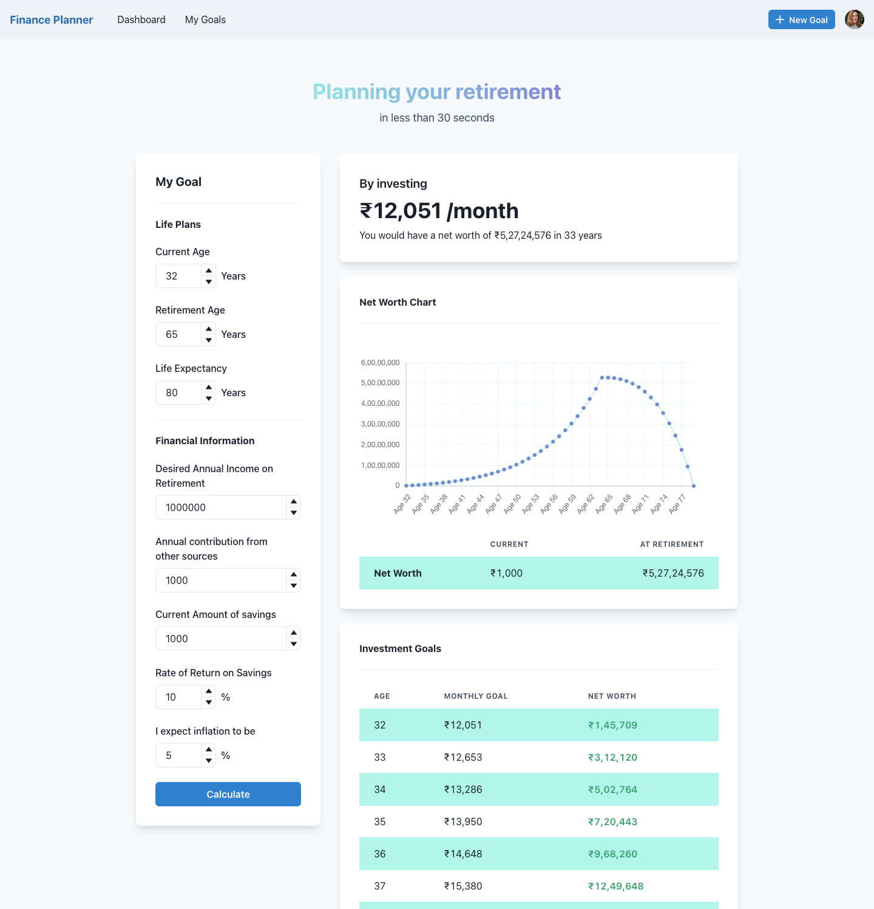

## 🎬 Project Overview
An app to help with everything you need to know while making a huge fiancial decision like buying a new iPhone or a car or even planning your retirement.

Simple & clean ui and evethitng is rendered client side!!!



This is a [Next.js](https://nextjs.org/) project bootstrapped with [`create-next-app`](https://github.com/vercel/next.js/tree/canary/packages/create-next-app).

## 🥞 Tech Stack
- Next.js - The React Framework
- Chakra UI - React component library
- Chart.js - JavaScript charting library


## 🏁 Getting Started

Fitst clone the repo
```git
git clone https://github.com/joelm-code/next-finance-app
```
Install all the dependencies
```node
npm install
```

First, run the development server:

```bash
npm run dev
```

Open [http://localhost:3000](http://localhost:3000) with your browser to see the magic.

## 📁 Folder Structure

```tree
.
├── README.md
├── components                  # All the custom components for the app
│   ├── Chart                   
│   │   └── LineChart.js        - Line Chart that uses Chartjs to map the data
│   ├── Footer
│   │   └── index.jsx           - Footer
│   ├── Layout
│   │   └── index.jsx           - Layout wraps all pages with header and footer
│   ├── MenuCustom
│   │   └── index.js            - Menu used for naviagation in the topbar
│   ├── Navbar
│   │   └── index.jsx           - Top bar of the app
│   ├── TypewriterEffect
│   │   └── index.jsx           - Typewritter effect for the hero
│   └── logic
│       └── index.js            - All the logic for calcualtions
│
│
├── pages                        # All the pages for the app  
│   ├── _app.js
│   ├── api
│   │   └── hello.js
│   ├── home
│   │   └── index.js            - Homepage
│   ├── index.js
│   ├── long-term-plan          -  Long Term Planning pages        
│   │   └── [planId]            -  Dynanamic Routing to Retirement, Education, etc
│   │       └── index.js        
│   └── purchase-plan           
│       └── [productId]         -  Short Term Planning pages        
│           └── index.js        - Dynamic Routing to Mobile, Car, etc
├── public
│   ├── favicon.ico
│   └── vercel.svg
├── styles
│   ├── Home.module.css
│   └── globals.css
└── variables
    ├── charts.js
    └── general.js
```


<p style=" text-align:center;font-size:20px;background: -webkit-linear-gradient( 132.6deg,  rgba(71,139,214,1) 23.3%, rgba(37,216,211,1) 84.7% );
  -webkit-background-clip: text;
  -webkit-text-fill-color: transparent;">Made with ❤️ by Joel</p>
